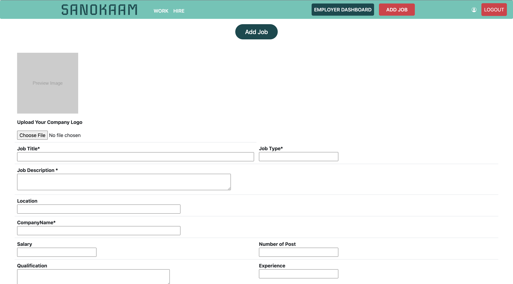
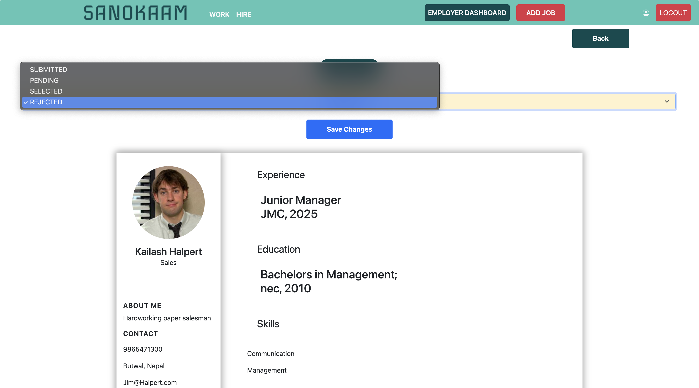
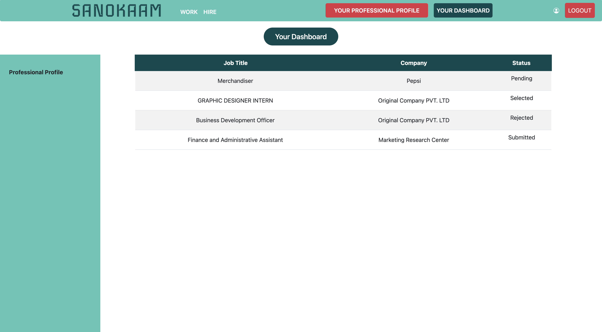
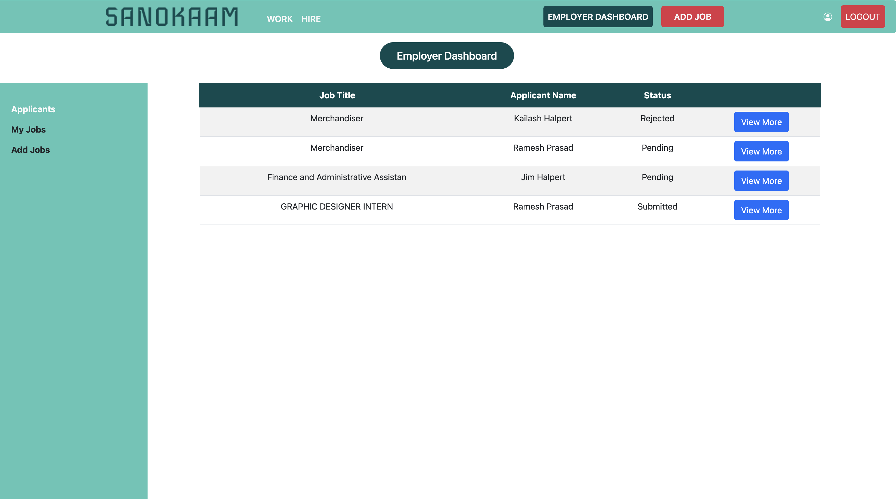
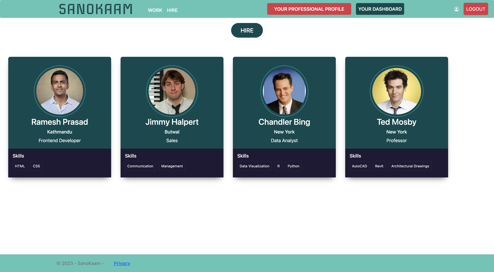
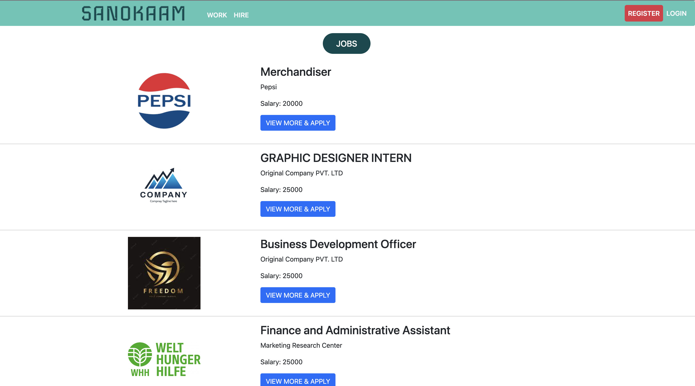

# SANOKAAM - A JobPortal

SANOKAAM is a comprehensive job portal that empowers employers to post jobs and review applicants while providing job seekers with a platform to view and apply for positions that match their preferences. The system includes individual dashboards for employees, employers, and administrators, offering a tailored experience for each user type. It is built using the .NET Framework with C#, MVC (Model-View-Controller) web application architecture, a SQL Server database, Entity Framework for data access, and incorporates HTML, CSS, Bootstrap, and jQuery for a modern and user-friendly interface.

## Table of Contents
- [Features](#features)
- [Installation](#installation)
- [Usage](#usage)
- [User Accounts](#user-accounts)
- [Screenshots](#screenshots)

## Features
- **Job Posting**: Employers can easily post job listings, providing detailed information about the position, qualifications, and application process.

- **Applicant Management**: Employers have the ability to review and manage job applicants, making the hiring process efficient and organized.

- **Job Search**: Job seekers can search for job listings based on various criteria, including job title, location, and industry.

- **Application Submission**: Job seekers can submit their applications online.

- **User Dashboards**: Every user type (employee, employer, and admin) has access to a personalized dashboard where they can manage their respective tasks and activities.

- **Secure Authentication**: The system uses a robust authentication system to protect user data and ensure that only authorized individuals can access their accounts.

## Installation

1. **Clone the Repository**: Clone the SANOKAAM repository to your local machine.

   ```bash
   git clone https://github.com/sushrit7/JobPortal.git
   ```

2. **Database Configuration**: Create a SQL Server database and update the connection string in the `appsettings.json` file.

3. **Build and Run**: Build the project and run it using Visual Studio or your preferred development environment.

## Usage

1. **User Registration**: Users can register for an account using the registration page. Different account types (employee, employer, admin) can be selected during registration.

2. **Login**: Users can log in using their credentials to access their personalized dashboards and perform actions based on their user type.

3. **Posting Jobs**: Employers can post job listings by providing job details, qualifications, and job-specific information.

4. **Applying for Jobs**: Job seekers can search for jobs and apply to positions that match their qualifications and preferences.

## User Accounts

The system has three main user account types:

- **Employee**: Job seekers who can search for jobs and apply.
- **Employer**: Employers who can post jobs and review applicants.
- **Admin**: Administrators who have overall control over the system, including managing users and system settings.

## Screenshots
### Screenshots

<div class="grid-container">
    <div class="homepage">
        
        <br>
        <em>Homepage</em>
    </div>
    <div class="addjob">
        
        <br>
        <em>Add Job</em>
    </div>
    <div class="applicant">
        
        <br>
        <em>Applicant</em>
    </div>
    <div class="applicationreview">
        
        <br>
        <em>Application Review</em>
    </div>
    <div class="employeedashboard">
        
        <br>
        <em>Employee Dashboard</em>
    </div>
    <div class="employerdashboard">
        
        <br>
        <em>Employer Dashboard</em>
    </div>
    <div class="hire">
        
        <br>
        <em>Hire</em>
    </div>
</div>


*Sample screenshot of the homepage.*


*Example of a job listing.*

_For more screenshots, please check the [Screenshots](/screenshots) directory._

---

Feel free to explore SANOKAAM - A JobPortal and contribute to its development. If you have any questions or encounter issues, please open a GitHub issue, and I'll be happy to assist you. Enjoy using SANOKAAM!
